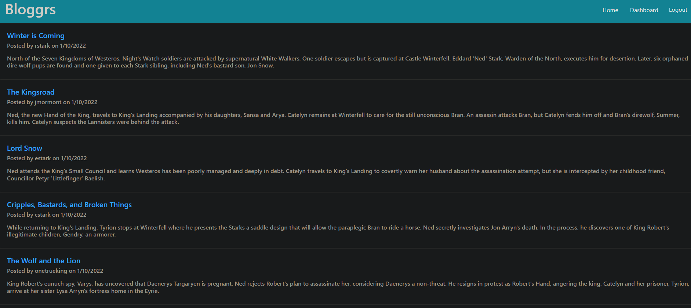
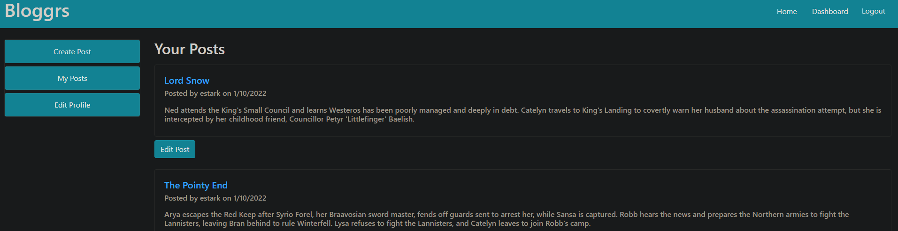

# bloggrs
## Badges

## Table of Contents
  - [Badges](#badges)
  - [Description](#description)
  - [Usage](#usage)
  - [Contributing](#contributing)
  - [Questions](#questions)
  - [Screenshots](#screenshots)
  - [Website](#website)

## Description
bloggrs is a fully functional blog, useable for technology or your favorite fan topics.

## Usage
To use this application, you must have:
1) MySQL 
2) Node.js

Once you have cloned the repo, you must follow these additional steps:
1) rename example.env in the root directory to .env
2) add your MySQL login name to DB_USER
3) add your MySQL password to DB_PW

Without following these steps, the application will not function.  

## Contributing
This project utilizes the [Contributor Covenant](https://www.contributor-covenant.org/version/2/1/code_of_conduct/).

## Questions
If you have any questions on this project:
* please [open an issue](https://github.com/Caeldeth/bloggrs/issues)
* or contact me via [email](mailto:tacolejr@gmail.com?subject=[Github%20Question%20-%20bloggrs]).

Visit my [profile](https://github.com/Caeldeth) to see more great projects!
  
## Screenshots

## Website
